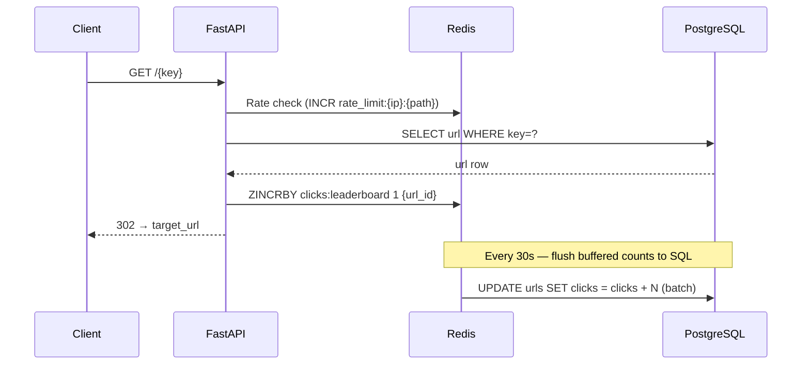

# URL Shortener Service

FastAPI URL shortener built to explore system design patterns: async I/O, race condition prevention, and Redis-buffered writes.

## Request flow



## Quickstart

**Local (SQLite, no Docker):**
```bash
python -m venv venv && source venv/bin/activate
pip install -r requirements.txt
uvicorn shortener_app.main:app --reload
```

**Docker (PostgreSQL + Redis):**
```bash
docker-compose up --build
```

Swagger UI at **http://localhost:8000/docs** — explore and test all endpoints interactively.

## API

| Method | Endpoint | Description |
|--------|----------|-------------|
| `POST` | `/url` | Create shortened URL |
| `GET` | `/{key}` | Redirect to target |
| `GET` | `/admin/{secret}` | View stats (flushed + buffered click count) |
| `DELETE` | `/admin/{secret}` | Deactivate URL |

## Configuration

```env
ENV_NAME=Local
BASE_URL=http://localhost:8000
DB_URL=sqlite+aiosqlite:///./shortener.db
REDIS_URL=redis://localhost:6379/0
RATE_LIMIT_ENABLED=true
RATE_LIMIT_CREATE=10
RATE_LIMIT_READ=100
CLICK_FLUSH_INTERVAL=30
USE_MIGRATIONS=false
```

## Tests

```bash
pytest tests/ -v
pytest tests/test_concurrency.py -v   # race condition tests
pytest tests/ --cov=shortener_app
```

## Further reading

[`docs/concurrency.md`](docs/concurrency.md) — race conditions, locking strategies, Redis buffering tradeoffs.
